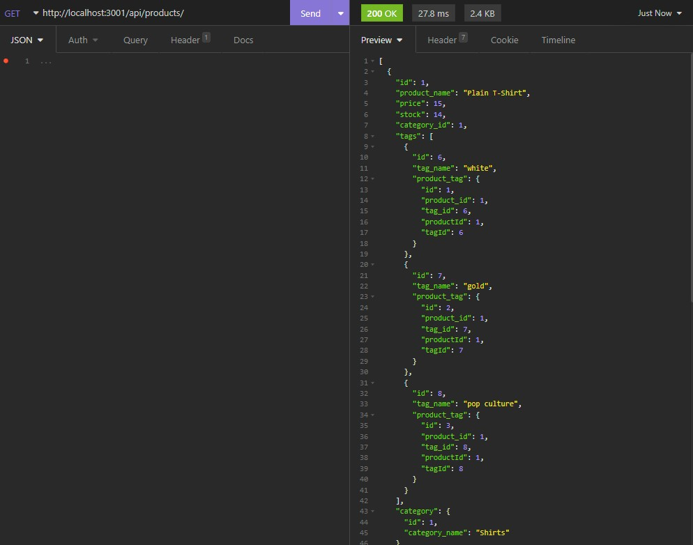

# E-commerce Backend [](http://www.wtfpl.net/about/)  

  ##Table of Contents
  - [About The Project](##Description)
  - [Installation](##Installation)
  - [Usage](##Usage)
  - [Contributors](##Contributing)
  - [License](##License)
  - [Questions](##Questions)

## Description 

    This homework was building a backend for an e-commerce store. To accomplish this, expressJS was used to create the server, MYSQL was used to store data, and sequelize was used to interact with the database.

    

    The acceptance criteria where as follows: 

    ```md
    GIVEN a functional Express.js API
    WHEN I add my database name, MySQL username, and MySQL password to an environment variable file
    THEN I am able to connect to a database using Sequelize
    WHEN I enter schema and seed commands
    THEN a development database is created and is seeded with test data
    WHEN I enter the command to invoke the application
    THEN my server is started and the Sequelize models are synced to the MySQL database
    WHEN I open API GET routes in Insomnia for categories, products, or tags
    THEN the data for each of these routes is displayed in a formatted JSON
    WHEN I test API POST, PUT, and DELETE routes in Insomnia
    THEN I am able to successfully create, update, and delete data in my database
    ``` 

## Installation  
  ```
  npm i
  ```

## Usage  
  node server.js.    

## Contributing  
  Do what you want man  

## License    
  DO WHAT THE FUCK YOU WANT TO PUBLIC LICENSE Version 2, December 2004 Copyright (C) 2004 Sam Hocevar <sam@hocevar.net> Everyone is permitted to copy and distribute verbatim or modified copies of this license document, and changing it is allowed as long as the name is changed.  
  
## Tests  
  ```
  none
  ```

# Questions  
  Have any questions? Feel free to reach out at:  
  [github](https://github.com/Squid300)  
  or email me at:  
  squid400@gmail.com
